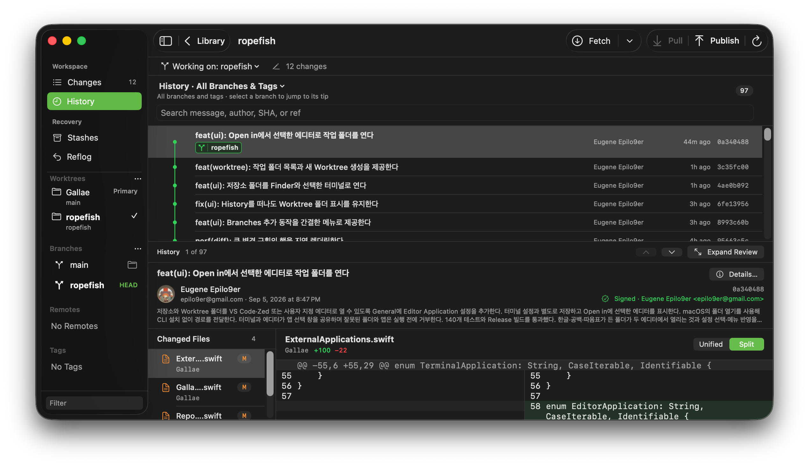
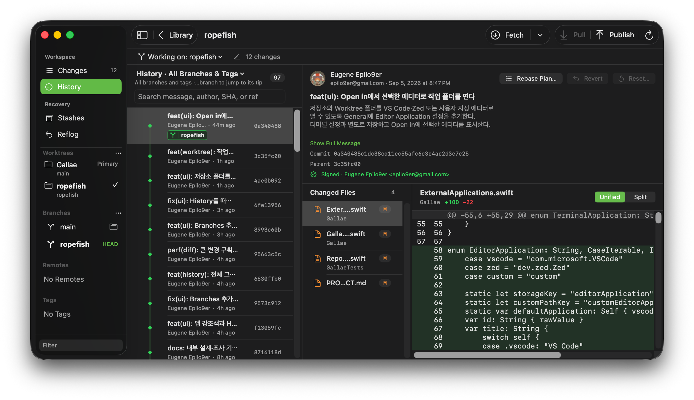

# Gallae for Git

**English** | [한국어](README.ko.md)

A free, open-source Git GUI for macOS. Inspect local repositories, understand changes, and complete everyday Git tasks with a native desktop interface.

**Gallae uses the macOS system Git (`/usr/bin/git`).** It works with your existing local repositories and Git configuration without bundling a separate Git implementation.

> **Status: in development.** No public release is available yet. You can build the app from source.

| Top and Bottom (default) | Side by Side |
| :---: | :---: |
| [](docs/screenshots/history-top-and-bottom.png) | [](docs/screenshots/history-side-by-side.png) |

History layout and diff layout can be chosen independently. Click either screenshot to view it at full size.

## Features

| Area | Features |
| --- | --- |
| **Repository Library** | Register folders, browse repositories within them, reopen recent repositories, and restore the last workspace |
| **Review and commit** | Unified and split diffs, file/hunk/line staging and unstaging, commits, amend, and discard with confirmation |
| **History** | Graph across branches and tags, search by message/author/SHA/ref, per-file patches, author and signature details, revert, and reset |
| **Worktrees** | Browse primary and linked working folders, create worktrees with new or existing branches, open and remove worktrees |
| **Sync** | Fetch, fetch and prune, automatic fetch, fast-forward pull, push, publish, and remote management |
| **Merge and recovery** | Merge, rebase, conflict comparison, external merge tools, continue/abort, interactive rebase, stashes, and reflog |
| **External apps** | Open working folders in Finder, terminals, or editors; copy paths; install the `gallae [path]` command |

History defaults to a **Top and Bottom** layout: commits above, review below. Use **Expand Review** for more room, or choose **Side by Side** in Appearance. Clicking a branch once jumps to its commit in the full graph; double-clicking switches branches or opens the linked worktree.

The **⋯** menus beside Branches, Remotes, and Tags remain available when their lists are empty. **Add Remote…** saves a remote without fetching or publishing. **New Tag…** creates a local lightweight tag at a chosen commit (default: `HEAD`) without switching branches or pushing. The arrow beside **Worktrees** stays visible so you can expand or collapse the list.

Appearance settings include system/light/dark themes, row density, the app accent color, and History graph and badge colors. The app accent defaults to **System**, following your macOS setting.

## External applications

Choose **Open in** from a branch’s context menu or the current working location menu at the top of the workspace. The current branch opens the current working folder; a branch checked out in another worktree opens that folder. Actions are disabled for branches without a checked-out folder. Opening an external app does not change your checkout.

Select your default terminal and editor independently in **Settings → General**. The following presets are built in; terminal and editor pickers show installed apps.

| Purpose | Built-in choices | Action |
| --- | --- | --- |
| Finder | macOS Finder | Reveal the working folder |
| Terminal | Terminal, Ghostty, Warp, iTerm2, cmux, Kaku, WezTerm, kitty, Alacritty, Rio | Open a terminal in the selected working folder |
| Editor | VS Code, Zed | Open the selected working folder |
| Custom app | **Other…** in the terminal or editor picker | Select another macOS app that supports opening folders |

Applications must be installed separately. Folder handling in custom apps depends on the application.

### Conflict resolution and merge tools

When a regular merge encounters conflicts, Gallae preserves the merge state and opens **Changes → Conflicts**. Compare **Base**, **Ours**, and **Theirs**, or choose **Open in Merge Tool**. Select the tool in **Settings → General → Merge Tool**.

| Choice | Integration | After editing |
| --- | --- | --- |
| **Use Git Configuration** | Uses Git’s `merge.guitool`, falling back to `merge.tool` | Git may stage resolved files according to its configuration; Gallae refreshes the repository state. Tools requiring terminal input must be run in a terminal. |
| **VS Code** | Opens the 3-way Merge Editor with the base, both sides, and result file | Close the merge editor, review the result, then choose **Mark Resolved…** in Gallae |
| **Sublime Merge** | Opens its dedicated merge tool with the three versions and result file | Close the merge editor, review the result, then choose **Mark Resolved…** in Gallae |

VS Code and Sublime Merge use the command-line tools included in their installed apps. **Zed is available as an Open in editor, but is not a Merge Tool preset.**

External merging is available for regular files present on both sides. Direct VS Code and Sublime Merge integrations support UTF-8 text. Resolve deletion conflicts, symbolic links, and submodules using **Use Ours / Use Theirs** or a terminal. **Mark Resolved does not check for remaining conflict markers, so review the saved file first.** Once all conflicts are resolved, choose **Continue** to finish or **Abort…** to stop the merge.

Pull is **fast-forward only**. If histories have diverged, it stops without automatically merging.

## Git configuration

**Patch formatting is controlled for diff review and partial staging.** External diff tools, colors, prefixes, and context settings do not alter the patch format Gallae parses. Settings that affect file content, such as `core.autocrlf` and `.gitattributes`, are respected. See [how Gallae handles Git configuration](docs/git-configuration.md).

**Configuration errors are shown in the app.** If a setting prevents Git from running, Gallae surfaces the error so you can identify and fix it.

## Build from source

```sh
git clone <this repository>
cd Gallae
open Gallae.xcodeproj
```

For signing, create `Config/Local.xcconfig`. This file is ignored by Git so personal identifiers stay out of the repository.

```xcconfig
GALLAE_BUNDLE_ID = <your-bundle-id>
GALLAE_BUNDLE_ID[config=Debug] = <your-debug-bundle-id>
DEVELOPMENT_TEAM = <your-team-id>
```

Run tests from the command line:

```sh
xcodebuild test -project Gallae.xcodeproj -scheme Gallae -destination 'platform=macOS'
```

**Requirements:** macOS 15 or later, Xcode, and system Git (Xcode Command Line Tools).

## Documentation

The detailed project documentation is currently in Korean.

| Document | Contents |
| --- | --- |
| [PRODUCT.md](PRODUCT.md) | Current scope, UX and development guidelines, and clean-room principles |
| [CONTEXT.md](CONTEXT.md) | Domain terminology |
| [DESIGN_SYSTEM.md](DESIGN_SYSTEM.md) | Materials, contrast, and density |
| [Git configuration](docs/git-configuration.md) | How Gallae handles Git settings |
| [Use cases](docs/README.md) | User workflows and expected behavior |

## Contributing

Implementation is based on documented Git behavior, public Apple APIs, and the Human Interface Guidelines. We do not reuse competing apps’ code, assets, wording, or exact design measurements. See the [clean-room principles in PRODUCT.md](PRODUCT.md#클린룸-원칙).

Logic with branches or loops should include a small integration test using a temporary repository.

## License

[MIT License](LICENSE)
